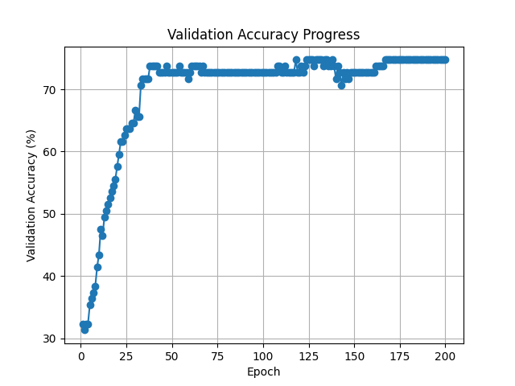

# neural-topic-classification
LT2222 Assignment 3: Neural Topic Classification for Simplified Chinese

## Below are the step by step instructions to run the scripts for this assignment.
Before you start, make sure you are in the root directory of the repository (the one containing this README file).

### Step 1: Download the input files
Run the following command in the terminal to download the input files (train, dev, test, and labels)
into a directory named "data":
```bash
$ python3 download_input_files.py --data-dir data
```
This will create a "data" directory in your current working directory and download the necessary
files into it.
```
data/dev.tsv                                                           100%[============================================================================================================================================================================>]  12.35K  --.-KB/s    in 0s

2026-04-08 22:34:20 (207 MB/s) - ‘data/dev.tsv’ saved [12647/12647]

--2026-04-08 22:34:20--  https://huggingface.co/datasets/Davlan/sib200/raw/main/data/zho_Hans/test.tsv
Resolving huggingface.co (huggingface.co)... 65.9.46.54, 65.9.46.59, 65.9.46.41, ...
Connecting to huggingface.co (huggingface.co)|65.9.46.54|:443... connected.
HTTP request sent, awaiting response... 200 OK
Length: 27922 (27K) [text/plain]
Saving to: ‘data/test.tsv’

data/test.tsv                                                          100%[============================================================================================================================================================================>]  27.27K  --.-KB/s    in 0.007s

2026-04-08 22:34:20 (4.09 MB/s) - ‘data/test.tsv’ saved [27922/27922]

--2026-04-08 22:34:20--  https://huggingface.co/datasets/Davlan/sib200/raw/main/data/zho_Hans/train.tsv
Resolving huggingface.co (huggingface.co)... 65.9.46.59, 65.9.46.41, 65.9.46.108, ...
Connecting to huggingface.co (huggingface.co)|65.9.46.59|:443... connected.
HTTP request sent, awaiting response... 200 OK
Length: 96974 (95K) [text/plain]
Saving to: ‘data/train.tsv’

data/train.tsv                                                         100%[============================================================================================================================================================================>]  94.70K  --.-KB/s    in 0.1s

2026-04-08 22:34:21 (895 KB/s) - ‘data/train.tsv’ saved [96974/96974]

Data loaded successfully into directory: data
```
### Step 2: Run the sentence embedding script
Run the following command in the terminal to compute sentence embeddings for the input files and save them to an output file named "embeddings.pkl":
```bash
$ python3 sentence_embeddings.py 1024 embeddings.pkl --train-file data/train.tsv --dev-file data/dev.tsv --test-file data/test.tsv
```
This will compute sentence embeddings for the train, dev, and test files using `Word2Vec`:
```bash
Embeddings saved successfully to embeddings.pkl
```

### Step 3: Run the neural topic classification script
Run the following command in the terminal to train a neural topic classification model using the computed sentence embeddings and save the trained model to an output file named "model.pth":
```bash
$ python3 neural_topic_classification.py embeddings.pkl 200 32 model.pth
```
This will train a neural topic classification model using the sentence embeddings from the previous
step, for 200 epochs, and batch size of 32, and save the trained model to "model.pth".
The script will also print the validation accuracy after each epoch of training:
```bash
Epoch 1/200, Validation Accuracy: 32.32%
Epoch 2/200, Validation Accuracy: 31.31%
Epoch 3/200, Validation Accuracy: 32.32%
.
.
.
Epoch 198/200, Validation Accuracy: 74.75%
Epoch 199/200, Validation Accuracy: 74.75%
Epoch 200/200, Validation Accuracy: 74.75%

Validation accuracy progress saved to validation_accuracy.png
Model saved successfully to model.pth
```
#### Validation Accuracy Progress Plotting (Bonus 1)
The script also saves the validation accuracy plot to a file named "validation_accuracy.png":



### Step 4: Evaluate the trained model on the test set
Run the following command in the terminal to evaluate the trained model (`model.pth`) on the test
set and print the test set accuracy and confusion matrix:
```bash
$ python3 evaluate_on_test.py embeddings.pkl model.pth
```
Which prints the following output:
```bash
Test Accuracy: 75.98%
Confusion Matrix:
true\pred                  entertainment           geography              health            politics  science/technology              sports              travel
entertainment                         10                   0                   0                   1                   5                   0                   3
geography                              0                  13                   0                   1                   1                   0                   2
health                                 0                   0                  18                   1                   2                   0                   1
politics                               0                   1                   1                  24                   0                   1                   3
science/technology                     1                   1                   3                   2                  40                   1                   3
sports                                 1                   4                   1                   1                   0                  18                   0
travel                                 0                   1                   0                   1                   5                   1                  32
```
We got ~76% accuracy on the test set, which is much better than chance (~14.3% for 7 classes).\
The confusion matrix shows majority of the predictions are correct (diagonal entries), with some
minor and not-systematic confusions.\
For example, there is some confusion between "entertainment" and "science/technology",
as well as between "geography" and "politics".
