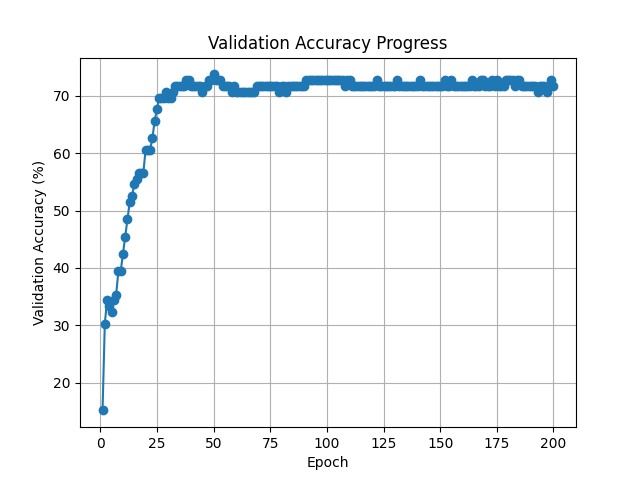
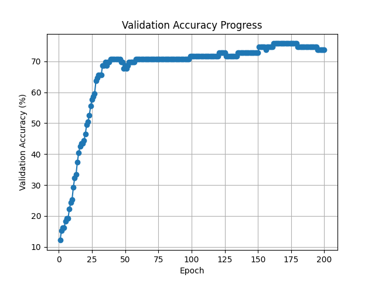

# neural-topic-classification
LT2222 Assignment 3: Neural Topic Classification for Simplified Chinese

## Below are the step by step instructions to run the scripts for this assignment.
Before you start, make sure you are in the root directory of the repository (the one containing this
README file).\
All the commands are provided in a single script file named `run_all.sh`, which you can run in the
terminal to execute all the steps sequentially.

### Step 1: Download the input files
Run the following command in the terminal to download the input files (train, dev, test, and labels)
into a directory named "data":
```bash
python3 download_input_files.py --data-dir data
```
This will create a "data" directory in your current working directory and download the necessary
files into it.

```bash
--2026-04-10 23:57:50--  https://huggingface.co/datasets/Davlan/sib200/raw/main/data/zho_Hans/dev.tsv
Resolving huggingface.co (huggingface.co)... 65.9.46.59, 65.9.46.54, 65.9.46.108, ...
Connecting to huggingface.co (huggingface.co)|65.9.46.59|:443... connected.
HTTP request sent, awaiting response... 200 OK
Length: 12647 (12K) [text/plain]
Saving to: ‘data/dev.tsv’

data/dev.tsv                                 100%[=============================================================================================>]  12.35K  --.-KB/s    in 0s

2026-04-10 23:57:50 (122 MB/s) - ‘data/dev.tsv’ saved [12647/12647]

--2026-04-10 23:57:50--  https://huggingface.co/datasets/Davlan/sib200/raw/main/data/zho_Hans/test.tsv
Resolving huggingface.co (huggingface.co)... 65.9.46.54, 65.9.46.108, 65.9.46.41, ...
Connecting to huggingface.co (huggingface.co)|65.9.46.54|:443... connected.
HTTP request sent, awaiting response... 200 OK
Length: 27922 (27K) [text/plain]
Saving to: ‘data/test.tsv’

data/test.tsv                                100%[=============================================================================================>]  27.27K  --.-KB/s    in 0.01s

2026-04-10 23:57:50 (2.23 MB/s) - ‘data/test.tsv’ saved [27922/27922]

--2026-04-10 23:57:50--  https://huggingface.co/datasets/Davlan/sib200/raw/main/data/zho_Hans/train.tsv
Resolving huggingface.co (huggingface.co)... 65.9.46.108, 65.9.46.41, 65.9.46.59, ...
Connecting to huggingface.co (huggingface.co)|65.9.46.108|:443... connected.
HTTP request sent, awaiting response... 200 OK
Length: 96974 (95K) [text/plain]
Saving to: ‘data/train.tsv’

data/train.tsv                               100%[=============================================================================================>]  94.70K  --.-KB/s    in 0.05s

2026-04-10 23:57:51 (1.94 MB/s) - ‘data/train.tsv’ saved [96974/96974]

Data loaded successfully into directory: data
```
### Step 2: Run the sentence embedding script
To handle latin words, as well as the context in the chinese text,  I increased the window size to 11
so that each chinese word (or latic character) is encoded with the context of 5 words on each side.\
Run the following command in the terminal to compute sentence embeddings for the input files and save them to an output file named "embeddings.pkl":
```bash
python3 sentence_embeddings.py 1024 embeddings.pkl --train-file data/train.tsv --dev-file data/dev.tsv --test-file data/test.tsv
```
This will compute sentence embeddings for the train, dev, and test files using `Word2Vec`:
```bash
Embeddings saved successfully to embeddings.pkl
```

### Step 3: Run the neural topic classification script
Run the following command in the terminal to train a neural topic classification model using the computed sentence embeddings and save the trained model to an output file named "model.pth":
```bash
python3 neural_topic_classification.py embeddings.pkl 200 32 model.pth
```
This will train a neural topic classification model using the sentence embeddings from the previous
step, for 200 epochs, and batch size of 32, and save the trained model to "model.pth".
The script will also print the validation accuracy after each epoch of training:
```bash
Epoch 1/200, Validation Accuracy: 15.15%
Epoch 2/200, Validation Accuracy: 30.30%
Epoch 3/200, Validation Accuracy: 34.34%
.
.
.
Epoch 198/200, Validation Accuracy: 71.72%
Epoch 199/200, Validation Accuracy: 72.73%
Epoch 200/200, Validation Accuracy: 71.72%

Validation accuracy progress saved to validation_accuracy.png
Model saved successfully to model.pth
```
#### Validation Accuracy Progress Plotting (Bonus 1)
The script also saves the validation accuracy plot to a file named "validation_accuracy.png":



### Step 4: Evaluate the trained model on the test set
Run the following command in the terminal to evaluate the trained model (`model.pth`) on the test
set and print the test set accuracy and confusion matrix:
```bash
python3 evaluate_on_test.py embeddings.pkl model.pth
```
Which prints the following output:
```bash
Test Accuracy: 75.98%
Confusion Matrix:
true\pred                  entertainment           geography              health            politics  science/technology              sports              travel
entertainment                         12                   0                   0                   1                   4                   0                   2
geography                              1                  13                   0                   0                   1                   0                   2
health                                 1                   0                  14                   1                   4                   0                   2
politics                               0                   1                   2                  24                   1                   0                   2
science/technology                     2                   1                   1                   3                  40                   0                   4
sports                                 1                   2                   2                   1                   0                  18                   1
travel                                 0                   1                   0                   0                   4                   1                  34
```
We got ~76% accuracy on the test set, which is much better than chance (~14.3% for 7 classes).\
The confusion matrix shows majority of the predictions are correct (diagonal entries), with some
minor and not-systematic confusions.\
For example, there is some confusion between "entertainment" and "science/technology",
as well as between "geography" and "politics".

### SIF Pooling Algorithm (Bonus 2)
The sentence embedding script now has the option to enable the SIF pooling algorithm instead of
simple averaging.\
To use SIF pooling, simply add the `--sif` flag when running the sentence embedding script:
```bash
python3 sentence_embeddings.py 1024 embeddings_sif.pkl --train-file data/train.tsv --dev-file data/dev.tsv --test-file data/test.tsv --sif
```
This will compute sentence embeddings using the SIF pooling algorithm and save them to "embeddings_sif.pkl".\

Now we can train the same neural topic classification model using the SIF embeddings:
```bash
python3 neural_topic_classification.py embeddings_sif.pkl 200 32 model_sif.pth
```

This will train a neural topic classification model using the SIF sentence embeddings and save the trained model to "model_sif.pth".\
The validation accuracy seems to be slightly better using SIF pooling, reaching around 74% accuracy on the validation set after 200 epochs.\



Finally, we can evaluate the SIF-based model on the test set:
```bash
python3 evaluate_on_test.py embeddings_sif.pkl model_sif.pth
```

Evaluation results shows similar accuracy with validation set:

```bash
Test Accuracy: 73.04%
Confusion Matrix:
true\pred                  entertainment           geography              health            politics  science/technology              sports              travel
entertainment                         10                   0                   0                   2                   4                   0                   3
geography                              1                  12                   0                   2                   1                   0                   1
health                                 2                   0                  17                   2                   1                   0                   0
politics                               0                   0                   1                  25                   0                   1                   3
science/technology                     1                   0                   1                   5                  40                   2                   2
sports                                 1                   3                   2                   1                   2                  16                   0
travel                                 0                   3                   0                   3                   3                   2                  29
```

Why SIF pooling did not improve the performance on the test set?\
I can think of a few reasons:
1. The dataset is relatively small, and the simple averaging of word embeddings might already capture
enough information for the classification task, leaving little room for improvement with SIF.
2. In the FastText model, we considered a window size of 11, which means that the word embeddings are already
influenced by the context. This might reduce the benefit of SIF, which is designed to mitigate the
influence of common words.
